# Clusy Crawler — Fast, Permissive Web Extraction Service

A small, self-hosted FastAPI service that turns any URL into clean, LLM-ready
markdown. Async I/O with HTTP/2 pooling, multi-strategy content extraction,
conditional JS rendering via Playwright, and a PDF/academic pipeline — with
**no LLM required** for extraction and no GPL/AGPL direct runtime dependencies.

Apache-2.0. Use the Docker image, or build from source with Python 3.12 and
Rust 1.85+.

```bash
docker build --build-arg GIT_SHA="$(git rev-parse HEAD)" -t clusy-crawler .
docker run --rm -d --name clusy-crawler -p 11235:11235 \
  --user 10001:10001 --init --read-only --shm-size=1g \
  --tmpfs /tmp:size=512m,mode=1777 \
  --tmpfs /home/crawler:size=64m,mode=0700,uid=10001,gid=10001 \
  --security-opt seccomp="$(pwd)/seccomp_profile.json" \
  --pids-limit=256 --memory=4g --cpus=2 \
  -e ENVIRONMENT=prod \
  -e CRAWL4AI_API_TOKEN=your-token clusy-crawler
curl -X POST localhost:11235/crawl \
  -H 'Authorization: Bearer your-token' -H 'content-type: application/json' \
  -d '{"urls":["https://example.com"]}'
```

## Architecture

A single stateless FastAPI service. Point any HTTP client at it and get clean
markdown back; add Redis for response caching (optional).

```
   your app ──HTTP──▶  ┌──────────────┐
                       │   crawler    │  FastAPI (:11235)
                       │  ┌────────┐  │  ├─ httpx (HTTP/2) fetch
                       │  │ redis? │  │  ├─ Playwright/Chromium (conditional JS)
                       │  └────────┘  │  └─ Rust extractor + Python/PDF fallbacks
                       └──────────────┘
```

No external services are required (Redis is optional; the LLM
structured-extraction format is an optional extra).

## Crawl Pipeline

<p align="center">
  
</p>

Each request flows through six stages:

1. **URL in** — validate request shape, scheme, and crawl options.
2. **Guard** — the SSRF check resolves the host and re-checks every redirect hop,
   refusing any that resolve to a private/loopback/link-local/metadata address.
3. **Fetch** — `httpx` over HTTP/2, with a size cap on the decompressed body.
   A Redis cache (optional) short-circuits repeat fetches.
4. **Render?** — *conditional*. Automatic mode fetches static HTML first and
   escalates when it sees a bot wall, a sparse JS shell, or an empty extraction.
   Explicit/forced JS requests go directly to Chromium and avoid a redundant
   static fetch.
5. **Extract** — the native Rust/PyO3 backend runs first. A confidence-gated
   Python pipeline (trafilatura, readability, markdownify, and targeted
   documentation/GitHub extractors) remains available as a fallback. PDFs go
   through a structured academic parser.
6. **Markdown** — clean, LLM-ready markdown out (optionally `html`, `links`, or
   schema-constrained JSON).

## Benchmark Evidence

Four commit-pinned public corpora exercise the exact production extractor. The
profiles and metrics are explicit because article-body text and general
main-content Markdown are different output contracts; no label-dependent
routing or scoring-only cleanup is used.

### Clean release-candidate result

The full AEB corpus was rerun from clean public commit
[`c3ae00d`](https://github.com/clusy-io/clusy-crawler/commit/c3ae00d90b19003b7c635af5dec87ba177abbd85)
through the production asynchronous entry point:

| Suite / production profile | Pages | Metric | Precision | Recall | F1 | Extraction throughput |
|---|---:|---|---:|---:|---:|---:|
| AEB `article_body` | 181 | 4-token shingle | 0.951014 | 0.989665 | **0.969955** | **133.3 pages/s** |

On Zyte/ScrapingHub's Article Extraction Benchmark (AEB), Clusy exactly matches
the pinned leading open-source `rs-trafilatura` result on every aggregate
metric. Against Trafilatura 2.0, ΔF1 is +0.012452 with a paired-bootstrap 95% CI
of [+0.002093, +0.023745] and `P(Clusy > Trafilatura) = 0.9892`. This is a
result that **ties the pinned AEB article-body F1 leader**, not an independent
algorithmic win: Clusy deliberately embeds that pinned Rust backend.

The clean run used all 181 pages, two workers, five warmup pages, and 10,000
paired-bootstrap replicates. It completed with zero extraction errors, p50
12.97 ms, p95 30.59 ms, and 246,333,440 bytes peak RSS. The harness marked the
result `CLAIMABLE` within the narrow scope **AEB article-body extraction only**.
Throughput is an in-memory extractor measurement on an Apple M4 Pro and should
not be generalized to live-network crawling or other hardware.

### Broader full-corpus diagnostics

The following complete runs are useful engineering evidence, but were produced
from a dirty development tree and are therefore watermarked `NOT CLAIMABLE` by
their harnesses. They are not release claims.

| Suite / production profile | Pages | Metric | Precision | Recall | F1 | Extraction throughput |
|---|---:|---|---:|---:|---:|---:|
| WCXB `balanced` | 2,008 | bag-of-words | 0.863443 | 0.906577 | **0.859450** | 82.0 pages/s |
| Webis `balanced` | 3,985 | macro ROUGE-LSum | 0.867148 | 0.908456 | **0.854920** | 277.6 pages/s |
| WebMainBench `balanced`, Direct-MD raw | 7,809 | macro ROUGE-5 | 0.615569 | 0.677841 | **0.606672** | 117.6 pages/s |

On WCXB's seven page types, the default `balanced` profile scores 0.848433 on
development and 0.891727 on the public test split, with zero extraction errors.
Both are below the current published `rs-trafilatura` results of 0.859 and
0.903 respectively. The combined 0.859450 score is not comparable to the
website's development-only 0.859 headline. WCXB's labels are public, its
leading baseline shares an author with the benchmark, and its published
headline predictions are not completely available for a locally reproducible
paired comparison.

On the peer-reviewed SIGIR 2023 Webis benchmark, Clusy completes all eight
datasets with no extraction errors or empty predictions. Its equal-dataset
macro ROUGE-LSum F1 is 0.854920, below the pinned best single-system result
(Trafilatura, 0.883461) and weighted ensemble (0.898844). Extraction itself is
fast; the official ROUGE-LSum scorer, not extraction, dominates wall time.

On WebMainBench's 7,809 pages from 5,434 domains, the fast deterministic path
scores 0.606672 mean ROUGE-5 F1 with zero errors. That is below the published
Trafilatura row (0.6402) and the leading model-assisted pipeline (0.9098), so
Clusy is not SOTA on this modern broad benchmark. Clusy emits Direct Markdown,
whereas the leaderboard's main `HTML+MD` rows extract HTML and apply a common
converter; the score is useful same-data evidence, not an unconditional
leaderboard placement. A second annotation-marker-scrubbed track scores
0.605703, showing the result does not rely on the released HTML's label
artifacts.

Every validation harness records the exact corpus, evaluator, source, lockfile,
native binary, environment, raw prediction, and artifact hashes. The AEB result
above is clean and claimable only within its stated scope; the broader rows
remain reproducibility targets until each suite is rerun from a clean commit.
See
[`bench/NEUTRAL_BENCHMARK.md`](bench/NEUTRAL_BENCHMARK.md) and
[`bench/WCXB_BENCHMARK.md`](bench/WCXB_BENCHMARK.md),
[`bench/WEBIS_BENCHMARK.md`](bench/WEBIS_BENCHMARK.md), and
[`bench/WEBMAINBENCH_BENCHMARK.md`](bench/WEBMAINBENCH_BENCHMARK.md).
The target system design and promotion gates are in
[`docs/SOTA_ARCHITECTURE.md`](docs/SOTA_ARCHITECTURE.md); a matched, sealed
Exa/Firecrawl comparison must follow
[`bench/LIVE_VENDOR_BENCHMARK.md`](bench/LIVE_VENDOR_BENCHMARK.md).

These suites measure extraction from frozen HTML. They do not measure live
network fetches, discovery completeness, robots compliance, JavaScript
rendering, or distributed crawl recovery.

**Not covered:** bypassing bot walls (Cloudflare/DataDome — e.g. Reuters, ACM)
is out of scope. For recognized ACM/DOI, ScienceDirect PII, and IEEE document
URLs, a failed or obviously sparse publisher page can fall back to official
metadata APIs. That path is explicitly labelled `academic-metadata-*` and never
claims that bibliographic metadata or an abstract is article full text.

### What the engine does well

- **No LLM required** — deterministic, cheap, private extraction. Nothing is
  sent to a third-party model to produce clean markdown.
- **Fast** — async I/O, HTTP/2 connection pooling, conditional (not default)
  JS rendering, and aggressive Redis caching keep live-fetch latency low.
- **Academic / PDF-aware** — arXiv HTML→PDF fallback and structured paper
  parsing (title, authors, abstract, sections, references).
- **Brotli/zstd correct** — bundles the `brotli`/`zstandard` decoders so
  Cloudflare-fronted sites (which default to `content-encoding: br`) decode
  correctly instead of returning binary garbage.

### Known limitations

- **Bot walls** (Cloudflare/DataDome, e.g. ACM, some news sites) are **out of
  scope** — defeating them needs managed residential proxies and TLS/JA3
  impersonation, a different class of (and legally fraught) solution.
- **Wikipedia-style dense tables** and heavy repo chrome are areas where
  dedicated commercial extractors still do better.

## Features

### Extraction Engine

- **Native-first extraction** — a Rust/PyO3 `rs-trafilatura` backend handles the
  primary path; confidence-gated Python strategies remain available for pages
  where the native result is unavailable or weak
- **Parallel fallback extraction** — Trafilatura, Readability, markdownify, and
  specialized extractors can run concurrently via `run_in_executor`, then
  union-merge
- **Page-type awareness** — distinguishes article, documentation, academic,
  repository, forum, product, listing, collection, and generic webpage content,
  then configures extraction and routing per type
- **Documentation extractor** — targets Sphinx, MkDocs, and Docusaurus
  `.rst-content` / `.md-content` / `.markdown-body`, strips nav sidebars,
  preserves code blocks, API signatures (dt/dd), and heading hierarchy
- **GitHub README extractor** — targets `article.markdown-body`, strips
  GitHub chrome (headers, sidebars, signup prompts, file navigation)
- **Academic pipeline** — pypdfium2 for PDF extraction, structured parsing for
  title, authors, abstract, sections, references. Auto arXiv PDF fallback
  when HTML abstract page is detected
- **Publisher metadata fallback** — exact DOI lookup through Crossref; optional
  `ELSEVIER_API_KEY` and `IEEE_API_KEY` enable the official publisher APIs.
  Requests use fixed API hosts, bounded JSON responses, short deadlines,
  concurrency limits, and the normal per-domain rate limiter. Without an IEEE
  key, a rendered title is accepted only after a high-similarity Crossref match
  whose DOI prefix and publisher identify IEEE.
- **Table → Markdown conversion** — post-extraction HTML table detection and
  conversion to markdown table format
- **Code block injection** — detects code blocks stripped by trafilatura and
  re-injects them from the original HTML

### Performance

- **HTTP/2 multiplexing** — multiple concurrent streams over single TCP
  connections (via `httpx[http2]`)
- **Full content-encoding support** — `gzip`/`deflate`/`br`/`zstd` decoders
  bundled; `Accept-Encoding` is negotiated by httpx to exactly what it can
  decode (advertising `br` without the decoder returns undecodable bytes)
- **Keep-alive connection pooling** — 30s `keepalive_expiry` reuses warm
  TCP+TLS across requests to a domain (inline pre-warming was removed — it
  added a serial HEAD round-trip *before* every fetch instead of saving one)
- **Single-pass extraction** — the conditional-JS path extracts once and
  re-extracts only when it actually escalates (was extracting twice per page)
- **Non-blocking pipeline** — PDF (pypdfium2), academic-HTML, and multi-strategy
  extraction run in executors, off the event loop
- **Configurable concurrency** — `asyncio.Semaphore`-gated in-flight
  operations (default 5) and browser pages (default 2)
- **Resource blocking** — images, fonts, media, and stylesheets are blocked
  during Playwright renders to reduce unnecessary work

### JS Rendering

- **Fresh browser contexts** — every render gets a new isolated context, which
  is destroyed after the request so cookies, storage, caches, and service
  workers cannot cross crawl boundaries
- **Smart escalation** — only launches browser when needed: bot-detection
  walls, SPA shells, sparse content (<200 chars visible text)
- **Static site exclusion** — known static sites (Python docs, Wikipedia,
  Rust Book, arXiv, PubMed, StackOverflow, MDN) skip JS entirely
- **Known dynamic domains** — ACM, Springer, IEEE, Nature, Medium, and Substack
  select the JS path automatically in conditional mode when `js_render` is
  omitted; an explicit request value takes precedence
- **Settle detection** — waits up to 2s for dynamic content on sparse
  pages, then extracts whatever is available
- **No anti-bot guarantee** — browser rendering executes JavaScript, but does
  not promise fingerprint anonymity or bypass Cloudflare/DataDome challenges

### Safety & Operations

- **SSRF protection** — static fetches validate every resolved address and
  redirect hop; browser renders validate document redirects and subrequest
  origins before allowing Chromium to connect
- **Defense in depth required** — DNS can change between validation and
  connection, and an egress proxy may resolve names differently. Deny private,
  loopback, link-local, and cloud-metadata networks at the container/VPC
  boundary as well
- **Browser contexts are defense in depth, not a tenant boundary** — every
  render gets a fresh context, but untrusted browser code still belongs in a
  dedicated container/VPC without mounted secrets or host paths
- **Per-domain rate limiting** — token bucket via `aiolimiter`, 2 req/s
  default with configurable burst. Per-domain locks prevent contention
- **Optional Redis cache** — versioned SHA-256 keys cover every
  output-affecting option/backend revision; corrupt entries become misses and
  Redis outages degrade to uncached operation
- **Singleflight miss coalescing** — concurrent identical requests share one
  live crawl while each caller receives an independent output projection
- **Bearer token auth** — constant-time comparison via `secrets.compare_digest`;
  set `CRAWL4AI_API_TOKEN` to protect crawl/extraction endpoints; health,
  readiness, version, and OpenAPI discovery remain public
- **Familiar endpoints** — `/crawl`, `/md`, `/html`, `/map`, `/health`, with
  request/response shapes that map cleanly onto common scrape APIs

### Familiar API surface

Endpoints and options modelled on the common scrape-API shape, so it's easy to
adopt if you already use a hosted crawler:

- **Multi-format output** — request any of `markdown` (always), `html` (rendered
  source), and `links` (deduped absolute links) per crawl via `formats`
- **`max_age` cache control** — `null` serves any cached entry within TTL, `0`
  bypasses the cache (always re-crawl), `N` serves cached only if younger than
  `N` seconds. Mirrors Firecrawl `maxAge` / Exa `maxAgeHours`
- **Extraction profiles** — `balanced` (default) targets general main-content
  Markdown; `article_body` explicitly requests the precision-oriented prose
  body path; `adaptive` runs `balanced` first and selectively escalates
  structurally risky generic pages to the optional pinned MinerU-HTML v1.1
  pipeline; `quality` requests that model path directly. Both model-assisted
  profiles fail safely back to the exact deterministic result
- **Structured (JSON) extraction** — pass a `json_schema` and/or
  `extraction_prompt` with the `json` format to get schema-constrained JSON
  back (LLM-backed, schema-validated). Optional: requires `ANTHROPIC_API_KEY`,
  configurable model (`EXTRACTION_MODEL`, default `claude-haiku-4-5`); degrades
  to a clear error when unconfigured, markdown crawl unaffected
- **`POST /map`** — bounded, concurrent sitemap-index discovery plus homepage
  links; redirect/peer SSRF checks, gzip expansion limits, same-site filtering,
  and an optional `search` substring filter

## API Reference

### `GET /health`
Returns `{"status": "ok"}`. Unauthenticated.

### `GET /health/ready`
Readiness probe. Checks the native extractor, process-local HTTP client
configuration, Playwright browser-process availability, and Redis (if
configured). It deliberately does not make an arbitrary Internet connectivity
request. Returns
`{"status": "ready", "checks": {...}}` or `{"status": "degraded", ...}` with
per-check status.

### `GET /health/version`
Returns build info including `native_extractor_version`, `trafilatura_version`,
and `playwright_version`.

### `POST /crawl`
Full crawl with markdown extraction and metadata.

**Request:**
```json
{
  "urls": ["https://example.com"],
  "max_depth": 0,
  "max_pages": 1,
  "allow_subdomains": false,
  "priority": 10,
  "js_render": false,
  "word_count_threshold": 10,
  "extraction_profile": "balanced",
  "wait_for_selector": null,
  "formats": ["markdown", "html", "links", "json"],
  "max_age": 3600,
  "json_schema": {
    "type": "object",
    "properties": {"title": {"type": "string"}, "summary": {"type": "string"}}
  },
  "extraction_prompt": "Extract the page title and a one-line summary."
}
```

`formats` defaults to `["markdown"]`. `html`/`links` are populated only when
requested; `json` runs schema-constrained LLM extraction into `extracted`
(needs `ANTHROPIC_API_KEY`). `max_age` is the cache-freshness bar in seconds
(`null` = any cached entry within TTL, `0` = always re-crawl).

Recursive discovery is explicitly opt-in with `max_depth > 0`. The default
`max_depth: 0` preserves the original behavior exactly: only explicit `urls`
are crawled, one result is returned for each input, and compatibility
`max_pages` does not truncate a multi-URL request. In recursive mode:

- `max_pages` is one total page budget across every seed and must be at least
  the number of seed URLs.
- `allow_subdomains` defaults to `false`; discovered URLs must remain on an
  exact seed host unless it is enabled.
- `priority` is applied to seed and discovered work. Hosts rotate fairly, while
  each host's higher-priority work runs first.
- every discovered URL passes canonical deduplication, depth/site/budget checks,
  and path, session, facet, query-variant, and calendar trap defenses.
- every seed and discovered URL is checked against its origin's `robots.txt`
  before the page fetch. Exact `ClusyCrawler` groups take precedence over the
  `*` fallback; longest matching `Allow`/`Disallow` wins and `Allow` wins a tie.
  Wildcards and end anchors are supported.
- static redirect targets and Playwright `document` navigations re-run both
  crawl-scope and robots checks before destination bytes. Same-origin path
  redirects are re-evaluated, and off-site redirects cannot escape the
  exact-host/subdomain scope.
- results are returned in deterministic frontier claim order and never exceed
  `max_pages`. Links are retained internally for discovery but are returned
  only when `formats` includes `"links"`.

Robots retrieval is manual and bounded: every redirect receives SSRF and
post-connect peer validation, HTTPS cannot downgrade to HTTP, and there are no
same-hop retries. A 2xx response is parsed; 404/410 and other non-429 4xx
responses allow crawling under RFC 9309's "unavailable" policy. A 408/425/429,
5xx, timeout, network/validation failure, redirect failure, oversized body, or
over-complex policy temporarily denies recursive crawling. A denied seed or
page is still returned with an honest `results[].error`, and the frontier
records `robots_disallowed`. There is intentionally no request-side bypass in
this release. Cached effective URLs are re-checked before use, and recursive
singleflight work is isolated from flat flights that have no policy callback.
None of this code runs for the default flat `max_depth: 0` path.

Request-side `extraction_strategy` and `verbose` remain accepted for Crawl4AI
wire compatibility.

`extraction_profile` accepts:

- `balanced` (default) — general main-content Markdown for heterogeneous web
  pages, including useful document structure when available.
- `article_body` — explicitly requests the precision-oriented prose body
  candidate. Use it when the desired output is article text rather than a
  page's broader Markdown structure. If no usable article candidate exists,
  the normal confidence-gated fallback pipeline still applies.
- `adaptive` — produces the exact `balanced` candidate first, then uses bounded
  confidence, page-type, and HTML-structure signals to decide whether to call
  the optional model-assisted pipeline. High-confidence simple pages pay no
  model cost; unavailable, timed-out, or invalid model results preserve the
  deterministic candidate.
- `quality` — asks the optional pinned MinerU-HTML v1.1 processing pipeline for
  model-assisted main-content Markdown. It requires the `quality` install/image
  target and three `QUALITY_EXTRACTION_*` endpoint settings. Timeouts,
  cancellation, oversized input, missing dependencies, circuit-open state, or
  invalid output all fall back to the exact `balanced` production path.

**Response:**
```json
{
  "status": "ok",
  "results": [{
    "url": "https://example.com",
    "markdown": "# Title\n\nContent...",
    "html": null,
    "links": null,
    "extracted": {"title": "Example Domain", "summary": "..."},
    "cached": false,
    "metadata": {
      "title": "Example Domain",
      "description": "...",
      "language": "en",
      "source_url": "https://example.com",
      "content_type": "text/html",
      "status_code": 200,
      "word_count": 350,
      "rendered": false,
      "extraction_strategy": "rs-trafilatura",
      "content_scope": "main_content",
      "truncated": false,
      "truncation_reason": ""
    },
    "error": null
  }],
  "total_time_ms": 453,
  "total_pages": 1
}
```

The batch envelope can return HTTP 200 while an individual URL reports
`results[].error`; production monitoring must inspect every result, not only the
outer status code. `content_scope` distinguishes full text, landing/abstract,
metadata-only, source, and general main-content results. When an extractor,
thread, references section, or configured output cap omits content,
`truncated=true` and `truncation_reason` make that partial result explicit.

### `POST /md`
Markdown-only extraction — a lightweight alias for `/crawl` with `formats:
["markdown"]`.

**Request:**
```json
{
  "url": "https://example.com",
  "word_count_threshold": 10,
  "extraction_profile": "balanced",
  "options": {
    "js_render": false,
    "only_main_content": true
  }
}
```

**Response:**
```json
{
  "status": "ok",
  "markdown": "# Title\n\nContent...",
  "metadata": { ... }
}
```

### `POST /html`
Raw HTML extraction.

**Request:**
```json
{ "url": "https://example.com", "js_render": false }
```

**Response:**
```json
{ "status": "ok", "html": "<!doctype html>...", "metadata": { ... } }
```

### `POST /map`
Discover a site's URLs (no rendering, no extraction) via robots.txt →
sitemap(s), supplemented with same-domain homepage links. Sitemap indexes are
traversed concurrently within fixed file/count/size limits.

**Request:**
```json
{ "url": "https://docs.python.org/3/", "limit": 1000, "search": "3.12" }
```

**Response:**
```json
{ "status": "ok", "url": "https://docs.python.org/3/", "links": ["https://..."], "count": 42 }
```

## Configuration

All settings via environment variables (`.env` file or process environment):

### Service

| Variable | Default | Description |
|----------|---------|-------------|
| `ENVIRONMENT` | `local` | `local`, `dev`, `test`, or `prod`; production fails closed without a bearer token. |
| `CRAWL4AI_API_TOKEN` | (empty) | Bearer token. Empty = unauthenticated — only safe on a trusted private network. |
| `GIT_SHA` | `unknown` | Immutable 7–64 character hexadecimal Git revision. Required in `prod` when Redis is configured, preventing cross-version cache reuse. |
| `CORS_ALLOW_ORIGINS` | (empty) | Comma-separated browser origins. Empty = CORS off. `*` discouraged. |
| `MAX_CONCURRENT_TASKS` | `5` | Global in-flight crawl operations cap. |
| `MAX_CONCURRENT_PAGES` | `2` | Max concurrent Playwright browser pages. Size this from measurements on your workload. |
| `MAX_PENDING_REQUESTS` | `100` | Maximum admitted and in-flight HTTP requests. |
| `MAX_REQUEST_BODY_BYTES` | `1048576` | Maximum request body size before rejection. |
| `CRAWL_REQUEST_TIMEOUT_S` | `120` | End-to-end request deadline. |
| `MAX_RESPONSE_OUTPUT_BYTES` | `33554432` | Maximum serialized batch-response size. |
| `MAP_TIMEOUT_S` | `30` | End-to-end `/map` deadline. |
| `MAP_MAX_DOWNLOAD_BYTES` | `20971520` | Aggregate sitemap download budget. |
| `MAP_MAX_CONCURRENCY` | `4` | Concurrent sitemap fetches. |
| `JS_RENDER_MODE` | `conditional` | `conditional` (auto-detect), `force` (always), `never` (no JS). |

### HTTP Client

| Variable | Default | Description |
|----------|---------|-------------|
| `HTTP_TIMEOUT_S` | `30` | Read timeout for HTTP requests. |
| `HTTP_CONNECT_TIMEOUT_S` | `5` | TCP/TLS connection timeout. |
| `HTTP_TOTAL_TIMEOUT_S` | `45` | Total bounded fetch deadline across attempts. |
| `HTTP_MAX_KEEPALIVE_CONNECTIONS` | `50` | Idle connections kept alive per host. |
| `HTTP_MAX_CONNECTIONS` | `100` | Total connection pool size. |
| `HTTP_USER_AGENT` | `ClusyCrawler/1.0` | User-Agent header. |
| `HTTP_MAX_ATTEMPTS` | `3` | Maximum rate-limited transport/status attempts. |
| `HTTP_RETRY_MAX_DELAY_S` | `5` | Maximum bounded retry delay. |
| `HTTP_PROXY` | (empty) | Optional HTTP(S) fetch proxy URL. |
| `PLAYWRIGHT_PROXY` | (empty) | Optional Playwright proxy URL. |

### Recursive robots policy

| Variable | Default | Description |
|----------|---------|-------------|
| `ROBOTS_TIMEOUT_S` | `5` | Total rate-limit, redirect, and network deadline for one policy fetch. |
| `ROBOTS_MAX_REDIRECTS` | `5` | Maximum manually followed, SSRF-validated redirect hops. |
| `ROBOTS_MAX_BODY_BYTES` | `524288` | Maximum decoded robots body size. |
| `ROBOTS_MAX_URL_LENGTH` | `4096` | Maximum policy URL length. |
| `ROBOTS_MAX_RULES` | `4096` | Maximum parsed rules per effective policy. |
| `ROBOTS_MAX_RECORDS` | `8192` | Maximum parsed records per policy. |
| `ROBOTS_MAX_LINE_CHARS` | `8192` | Maximum decoded policy line length. |
| `ROBOTS_MAX_CONCURRENCY` | `16` | Process-local concurrent origin-policy fetches. |
| `ROBOTS_CACHE_MAX_ENTRIES` | `2048` | Loop-local LRU entry bound; cached entries contain parsed rules, not bodies. |
| `ROBOTS_CACHE_TTL_S` | `3600` | Parsed 2xx policy TTL. |
| `ROBOTS_UNAVAILABLE_CACHE_TTL_S` | `900` | Allowing 4xx-unavailable policy TTL. |
| `ROBOTS_ERROR_CACHE_TTL_S` | `60` | Fail-closed transient/unsafe policy TTL. |

### Extraction

| Variable | Default | Description |
|----------|---------|-------------|
| `PARALLEL_EXTRACTION_ENABLED` | `true` | Run strategies concurrently. |
| `EXTRACTION_MERGE_MODE` | `union` | `union` (multi-strategy merge), `best`, `longest`. |
| `NATIVE_EXTRACTION_ENABLED` | `true` | Use the compiled Rust/PyO3 backend as the primary extractor. |
| `NATIVE_EXTRACTION_MIN_CONFIDENCE` | `0.60` | Fall back to Python below this native confidence. |
| `MAX_CONCURRENT_EXTRACTIONS` | `2` | Max concurrent page-level CPU extraction jobs. |
| `EXTRACT_MAX_TEXT_LENGTH` | `500000` | Max characters in extracted text. |
| `ADAPTIVE_EXTRACTION_MIN_CONFIDENCE` | `0.75` | Adaptive requests escalate candidates below this confidence. |
| `ADAPTIVE_EXTRACTION_STRUCTURAL_SCORE_THRESHOLD` | `3` | Bounded structural-complexity score that triggers adaptive escalation. |
| `ADAPTIVE_EXTRACTION_MAX_SCAN_CHARS` | `200000` | Maximum HTML prefix inspected by the adaptive router. |
| `ADAPTIVE_EXTRACTION_RISKY_PAGE_TYPES` | `collection,listing,product` | Comma-separated deterministic page types that trigger adaptive escalation. |

### Model-assisted main content (optional, `adaptive` / `quality` profiles)

| Variable | Default | Description |
|----------|---------|-------------|
| `QUALITY_EXTRACTION_BASE_URL` | (empty) | Operator-controlled OpenAI-compatible endpoint; empty disables this path. |
| `QUALITY_EXTRACTION_API_KEY` | (empty) | Endpoint credential; never included in crawler logs. |
| `QUALITY_EXTRACTION_MODEL` | (empty) | Model served by the endpoint. |
| `QUALITY_EXTRACTION_PROMPT_PROFILE` | `openai_json` | `openai_json` uses the upstream v2/JSON contract for general instruction models; `mineru_compact` uses the short_compact/compact wire contract for compatible compact checkpoints. |
| `QUALITY_EXTRACTION_TIMEOUT_S` | `45` | Total queue-and-inference deadline. |
| `QUALITY_EXTRACTION_CAPACITY_TIMEOUT_S` | `1` | Maximum queue wait for a model worker before deterministic fallback opens the capacity circuit. |
| `QUALITY_EXTRACTION_SHUTDOWN_TIMEOUT_S` | `5` | Bounded worker drain and quality-client cleanup deadline during graceful shutdown. |
| `QUALITY_EXTRACTION_MAX_INPUT_CHARS` | `1000000` | Reject model inference above this input size and use deterministic fallback. |
| `QUALITY_EXTRACTION_MAX_CONCURRENCY` | `2` | Maximum live model workers, including workers whose callers timed out. |
| `QUALITY_EXTRACTION_FAILURE_THRESHOLD` | `3` | Consecutive failures before the circuit opens. |
| `QUALITY_EXTRACTION_COOLDOWN_S` | `30` | Circuit-breaker cooldown before one half-open probe. |

The optional package is source-pinned to MinerU-HTML revision
`73cf266690befd209cae7e6fdff9716d5b31a976`. The crawler does not ship a model
server or silently send pages anywhere: operators must configure their own
endpoint. Upstream benchmark numbers are not Clusy benchmark numbers; only a
run through the checked-in Clusy harness is evidence for this service.

The MinerU-HTML *code* is Apache-2.0, but the official v1.1 compact weights are
derived from Tencent Hunyuan and carry a separate community license that
excludes use in the EU, UK, and South Korea and restricts model-improvement
uses. Clusy does not bundle those weights. A globally deployed platform must
serve a checkpoint whose model, training-data, and output licenses have passed
legal review; `mineru_compact` describes a protocol, not approval of a
particular checkpoint.

Redis reads and writes are deliberately disabled for `adaptive` and `quality`.
Model availability and circuit state can change between calls; caching either a
model response or a temporary deterministic fallback would make that transient
state persist for the full cache TTL. Concurrent identical requests still share
one in-process singleflight whose key covers the model, pinned pipeline/router
revisions, and every adaptive threshold.

### Scholarly metadata fallbacks

| Variable | Default | Description |
|----------|---------|-------------|
| `SCHOLARLY_METADATA_ENABLED` | `true` | Allow bounded metadata-only fallback for recognized publisher URLs. |
| `SCHOLARLY_METADATA_TIMEOUT_S` | `8` | Total metadata lookup deadline. |
| `SCHOLARLY_METADATA_MAX_CONCURRENCY` | `2` | Process-wide concurrent metadata lookups. |
| `SCHOLARLY_METADATA_MAX_RESPONSE_BYTES` | `524288` | Maximum decoded JSON response size. |
| `ACADEMIC_PDF_FALLBACK_TIMEOUT_S` | `12` | Shared wall-clock budget for all PDF candidates advertised by one landing page. |
| `ELSEVIER_API_KEY` | (empty) | Enables official ScienceDirect PII lookup. |
| `IEEE_API_KEY` | (empty) | Enables official IEEE article-number lookup. |

### Playwright / JS Rendering

| Variable | Default | Description |
|----------|---------|-------------|
| `PLAYWRIGHT_ENABLED` | `true` | Enable browser-based JS rendering. |
| `PLAYWRIGHT_JAVA_SCRIPT_ENABLED` | `true` | Allow JS requests and automatic escalation. |
| `PLAYWRIGHT_TIMEOUT_S` | `30` | Max time for Playwright page load. |
| `PLAYWRIGHT_DISABLE_SANDBOX` | `false` | Keep Chromium's sandbox enabled. Use the escape hatch only inside a separately isolated runtime. |
| `PLAYWRIGHT_MAX_HTML_BYTES` | `10485760` | Maximum serialized rendered HTML size. |

### Rate Limiting

| Variable | Default | Description |
|----------|---------|-------------|
| `RATE_LIMIT_REQUESTS_PER_SECOND` | `2.0` | Per-domain token bucket fill rate. |
| `RATE_LIMIT_BURST` | `5` | Maximum burst before throttling. |
| `RATE_LIMIT_MAX_DOMAINS` | `1000` | Bound on process-local domain limiter state. |

### Cache

| Variable | Default | Description |
|----------|---------|-------------|
| `REDIS_URL` | (empty) | Redis connection string. Empty = no caching. |
| `CACHE_TTL_S` | `3600` | Cache entry TTL in seconds. |
| `CACHE_CONNECT_TIMEOUT_S` | `0.75` | Redis connect deadline. |
| `CACHE_OPERATION_TIMEOUT_S` | `0.5` | Redis read/write deadline. |
| `CACHE_FAILURE_COOLDOWN_S` | `5` | Cooldown after Redis transport failures. |
| `CACHE_MAX_ENTRY_BYTES` | `1048576` | Maximum serialized cache entry size. |

### Structured extraction (optional, `json` format)

| Variable | Default | Description |
|----------|---------|-------------|
| `ANTHROPIC_API_KEY` | (empty) | Enables `json` extraction. Empty = feature disabled. |
| `EXTRACTION_MODEL` | `claude-haiku-4-5` | Model for extraction. Set to `claude-opus-4-8` for higher quality. |
| `EXTRACTION_MAX_TOKENS` | `8192` | Max output tokens per extraction. |
| `EXTRACTION_MAX_INPUT_CHARS` | `100000` | Page content truncation before extraction. |
| `STRUCTURED_EXTRACTION_MAX_CONCURRENCY` | `2` | Maximum concurrent schema/prompt extraction calls. |
| `STRUCTURED_EXTRACTION_TIMEOUT_S` | `45` | Total structured-extraction deadline. |

With uv, install this feature using `uv sync --extra llm` (combine it with
`--extra dev` for development). The pip workflow is documented below.

## Project Structure

```
crawler/
├── app/
│   ├── main.py                    # FastAPI app, lifespan, middleware, routers
│   ├── config.py                  # pydantic-settings (all env vars)
│   ├── models/
│   │   ├── requests.py            # Pydantic request models
│   │   └── responses.py           # Pydantic response models
│   ├── routers/
│   │   ├── health.py              # /health, /health/ready, /health/version
│   │   ├── crawl.py               # POST /crawl
│   │   ├── extract.py             # POST /md, POST /html
│   │   └── map.py                 # POST /map (URL discovery)
│   ├── services/
│   │   ├── crawler.py             # Pipeline orchestrator
│   │   ├── fetcher.py             # httpx GET + SSRF guard + JS routing
│   │   ├── extractor.py           # Native-first, confidence-gated extraction
│   │   ├── renderer.py            # Playwright isolation + request safety routing
│   │   ├── rate_limiter.py        # Per-domain token bucket
│   │   ├── academic.py            # PDF + structured academic paper parser
│   │   ├── scholarly_metadata.py  # Bounded official metadata-API fallbacks
│   │   ├── site_map.py            # Sitemap + homepage link discovery (/map)
│   │   └── structured.py          # Optional LLM JSON extraction (json format)
│   ├── cache/
│   │   └── __init__.py            # Optional Redis cache (timestamped, max_age)
│   ├── middleware/
│   │   └── auth.py                # Bearer token middleware
│   └── lib/
│       ├── http_client.py         # Singleton httpx client + DNS cache
│       └── logging.py             # structlog JSON config
├── tests/
│   ├── conftest.py                # Fixtures, mock cache/rate limiter
│   ├── unit/                      # Extraction, fetch, render, cache, lifecycle
│   ├── integration/               # HTTP endpoints, auth, health, validation
│   └── load/                      # Concurrency and semaphore behavior
├── bench/                         # Benchmark harnesses
│   ├── neutral_benchmark.py       # Pinned AEB article-body evaluation
│   ├── wcxb_benchmark.py          # Pinned seven-type WCXB evaluation
│   ├── *_BENCHMARK.md             # Reproduction, claim rules, current results
│   └── benchmark_*.py             # Project regression harnesses
├── native/                        # Rust/PyO3 primary extraction backend
│   ├── Cargo.toml                 # Rust 1.85+, pinned direct crates
│   ├── Cargo.lock                 # Exact Rust dependency graph
│   └── pyproject.toml             # maturin Python-extension build
├── Dockerfile                     # FastAPI + Playwright/Chromium runtime
├── docker-compose.yml             # Self-contained crawler + Redis stack
├── pyproject.toml                 # Dependencies, ruff, mypy, pytest config
├── .env.example                   # Environment configuration template
└── README.md
```

## Development

Source builds require Python 3.12, a Rust 1.85+ toolchain, and a native linker
supported by Cargo. Docker users do not need Rust installed on the host.

### uv workflow (recommended)

```bash
# Verify the compiler; `uv sync` then builds clusy-native through maturin.
rustc --version
uv sync --locked --extra dev
uv run playwright install chromium

# Verify that Python loaded the compiled extension and its pinned backend.
uv run python -c \
  "import clusy_native; print(clusy_native.backend_version())"

# Run locally
uv run uvicorn app.main:app --reload --port 11235

# Tests and static checks
uv run pytest tests/ -v
uv run ruff check .
uv run mypy app
```

`uv.lock` pins the Python graph and [`native/Cargo.lock`](native/Cargo.lock)
pins the Rust graph. After editing Rust sources, force a local extension rebuild:

```bash
uv sync --locked --extra dev --reinstall-package clusy-native
```

To enable optional LLM-backed JSON extraction, add `--extra llm` to the sync
command. To develop the model-assisted main-content path, add `--extra quality`;
the two extras are independent.

### pip/maturin workflow

`[tool.uv.sources]` is uv-specific, so generic pip users must build and install
the local extension before installing the root project:

```bash
python3.12 -m venv .venv
source .venv/bin/activate
python -m pip install --upgrade pip
python -m pip install "maturin>=1.9,<2.0"
maturin develop --release --locked --manifest-path native/Cargo.toml
python -m pip install -e ".[dev]"
python -m playwright install chromium
```

Use `".[dev,llm]"` in the pip command if structured extraction is required.

## Deploy

### Docker Compose

The checked-in Compose stack is self-contained: it builds the deterministic
runtime image, starts a bounded Redis cache, and publishes the crawler on
`localhost:11235`. Copy the example environment before starting it.

```bash
cp .env.example .env
GIT_SHA="$(git rev-parse HEAD)" docker compose up -d --build

curl -sf http://localhost:11235/health/ready
```

Local Compose defaults to `ENVIRONMENT=local`, which permits an empty bearer
token for development. Set `ENVIRONMENT=prod`, a non-empty
`CRAWL4AI_API_TOKEN`, and an exact `GIT_SHA` before exposing a deployment beyond
a trusted local machine.

### Bare Docker

```bash
docker build --build-arg GIT_SHA="$(git rev-parse HEAD)" -t clusy-crawler .
docker run --rm -d --name clusy-crawler -p 11235:11235 --shm-size=1g \
  --user 10001:10001 --init --read-only \
  --tmpfs /tmp:size=512m,mode=1777 \
  --tmpfs /home/crawler:size=64m,mode=0700,uid=10001,gid=10001 \
  --security-opt seccomp="$(pwd)/seccomp_profile.json" \
  --pids-limit=256 --memory=4g --cpus=2 \
  -e ENVIRONMENT=prod \
  -e CRAWL4AI_API_TOKEN=your-token clusy-crawler

curl -sf -X POST http://localhost:11235/crawl \
  -H 'Authorization: Bearer your-token' \
  -H 'Content-Type: application/json' \
  -d '{"urls":["https://example.com"]}'
```

The Dockerfile is a multi-stage build: digest-pinned `rust:1.85-slim` supplies
the toolchain, a digest-pinned Python 3.12/maturin stage builds a wheel using
`native/Cargo.lock` and exports hash-locked Python requirements from `uv.lock`.
The final Python 3.12 image receives only those verified dependencies, the
wheel, Chromium, and the application. The Rust compiler and Cargo caches are
not copied into the runtime stage. The service runs as the non-root `crawler`
user (UID 10001). `seccomp_profile.json` is the Playwright 1.60 profile derived
from Docker's default policy with `clone`, `setns`, and `unshare` permitted so
Chromium can create its user namespace sandbox. The checked-in Compose service
applies it automatically. It intentionally does not set
`no-new-privileges` or drop every Linux capability: on hosts that disable
unprivileged user namespaces, either setting would prevent Chromium's
version-matched SUID sandbox helper from providing the secure fallback. The
application process still runs non-root, and Chromium's sandbox remains
explicitly enabled.

The default `runtime` image is deterministic and does not contain MinerU-HTML.
Build the opt-in, revision-pinned quality image only when an operator endpoint
is available:

```bash
docker build --target quality-runtime \
  --build-arg GIT_SHA="$(git rev-parse HEAD)" -t clusy-crawler:quality .
# Or with Compose:
GIT_SHA="$(git rev-parse HEAD)" \
  CRAWLER_DOCKER_TARGET=quality-runtime docker compose build crawler
```

### Operational notes

- **Memory**: Chromium is the heaviest component. Observe real workload RSS and
  lower `MAX_CONCURRENT_TASKS` / `MAX_CONCURRENT_PAGES` if the container
  approaches its limit. The Compose example sets a 4 GiB hard limit.
- **`/dev/shm`**: the examples allocate 1 GiB for Chromium. Increase it if
  browser processes crash under parallel rendering.
- **Browser installation**: Chromium is included in the runtime image whether
  or not `PLAYWRIGHT_ENABLED` is false. That setting disables use at runtime; it
  does not create a smaller image. A static-only image requires a separate
  Dockerfile that omits the browser packages and install step.
- **Browser isolation**: URL validation reduces SSRF risk but cannot close every
  DNS/proxy time-of-check-to-time-of-use gap. Chromium's sandbox is explicitly
  enabled by default, the image runs non-root, and Compose applies the pinned
  Playwright seccomp profile. Keep all three controls. Put the service in a
  dedicated network and enforce outbound denies for RFC1918, loopback,
  link-local, and cloud metadata addresses.
- **Untrusted JavaScript**: do not mount secrets, the Docker socket, or writable
  host paths into the crawler container. Prefer a dedicated instance for each
  trust boundary.
- **Auth**: `ENVIRONMENT=prod` refuses to start without
  `CRAWL4AI_API_TOKEN` (or `CRAWLER_API_TOKEN`). Non-production modes may run
  unauthenticated for local development. Health diagnostics and OpenAPI
  discovery remain public. See [`SECURITY.md`](SECURITY.md).
- **Logs**: `docker compose logs -f crawler` (structured JSON via structlog).

## Key Dependencies

| Library | Version | Purpose |
|---------|---------|---------|
| `fastapi` + `uvicorn` | 0.115+ / 0.45+ | HTTP server |
| `httpx` + `h2` | 0.28+ / 4.3+ | Async HTTP with HTTP/2 |
| `brotli` + `zstandard` | 1.1+ / 0.23+ | Content-encoding decoders (required for Brotli/zstd sites) |
| `clusy-native` | 0.1.0 (local) | Primary Rust/PyO3 extraction extension |
| `rs-trafilatura` | pinned revisions in `native/Cargo.lock` | Native extraction engine |
| `pyo3` | 0.27.2 | Rust/Python extension bindings |
| `trafilatura` | >=2.0,<3.0 | Python extraction fallback (Apache-2.0) |
| `playwright` | 1.48+ | JS rendering via Chromium |
| `pypdfium2` | 4.30+ | PDF extraction (BSD; replaced AGPL PyMuPDF) |
| `readability-lxml` | 0.8+ | Mozilla Readability fallback |
| `markdownify` | 1.2+ | HTML → Markdown conversion (MIT; replaced GPLv3 html2text) |
| `aiolimiter` | 1.0+ | Per-domain rate limiting |
| `tenacity` | 9.0+ | Retry with exponential backoff |
| `structlog` | 24.4+ | Structured JSON logging |
| `redis` | 5.2+ | Optional response caching |
| `orjson` | 3.10+ | Fast JSON serialization |
| `anthropic` (extra: `llm`) | 0.69+ | Optional structured (JSON) extraction |
| `mineru-html` (extra/image: `quality`) | exact git revision | Optional model-assisted main-content extraction |

## Acknowledgements

Inspired by [crawl4ai](https://github.com/unclecode/crawl4ai), and built on the
excellent [trafilatura](https://github.com/adbar/trafilatura),
[readability-lxml](https://github.com/buriy/python-readability), and
[Playwright](https://github.com/microsoft/playwright). The neutral evaluation
uses Zyte's [article-extraction-benchmark](https://github.com/scrapinghub/article-extraction-benchmark).

## License

Apache License 2.0 — see [LICENSE](LICENSE). Third-party components and their
licenses are listed in [THIRD_PARTY_LICENSES.md](THIRD_PARTY_LICENSES.md).
